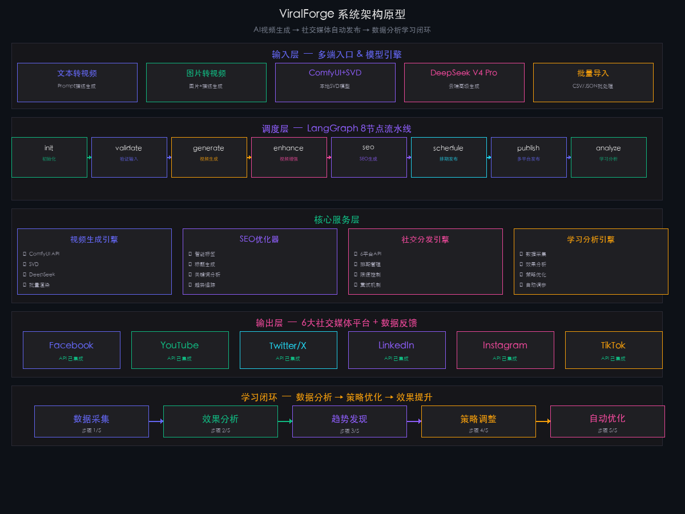
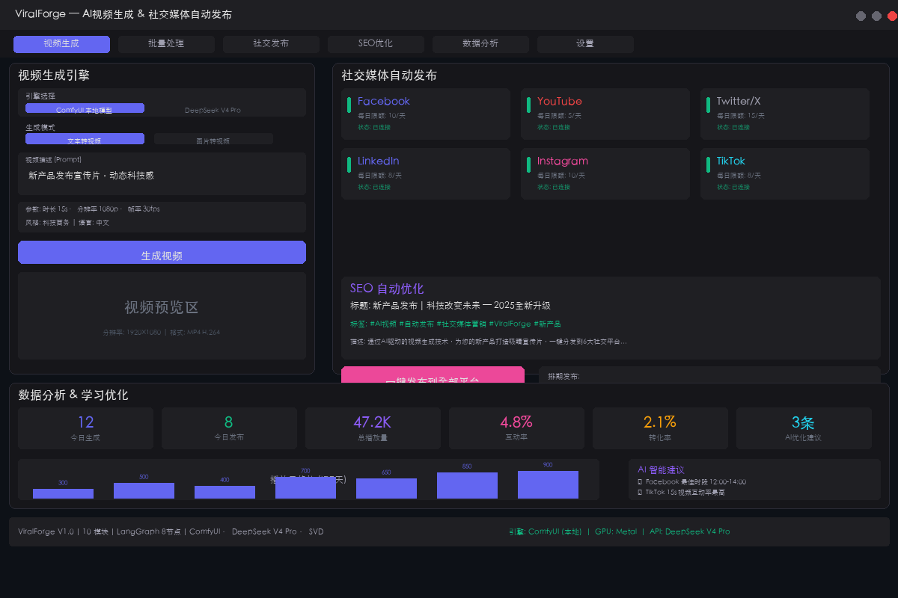
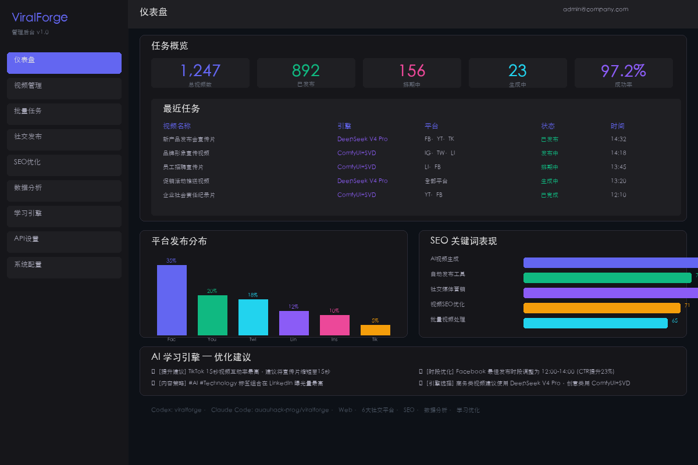
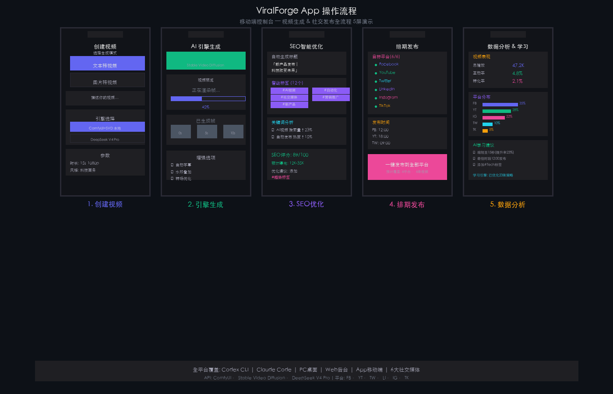

# ViralForge — AI视频生成 & 社交媒体自动发布

> ComfyUI / Stable Video Diffusion 本地模型 + DeepSeek V4 Pro 接入 · 文本转视频 · 图片转视频 · 一键发布6大社交平台

AI 驱动的视频营销自动化引擎。本地运行 Stable Video Diffusion 或接入 DeepSeek V4 Pro，批量生成宣传视频，智能 SEO 优化，一键发布到 Facebook、YouTube、Twitter、LinkedIn、Instagram、TikTok。内置学习引擎，持续优化发布策略。

[GitHub](https://github.com/auauhack-prog/-viralforgeseo) | [演示](https://skill.600.im) | [联系](https://skill.600.im)

## 设计原型

### 系统架构



### PC 桌面端界面



### Web 管理后台



### App 移动端操作流程



## 功能模块

| 模块 | 功能数 | 说明 |
|------|--------|------|
| 视频生成引擎 | 4 | 文本转视频、图片转视频、ComfyUI/SVD本地、DeepSeek V4 Pro远程 |
| SEO智能优化 | 4 | 自动标签、标题生成、关键词分析、趋势追踪 |
| 社交分发引擎 | 6 | Facebook / YouTube / Twitter / LinkedIn / Instagram / TikTok |
| 批量处理 | 3 | CSV导入、JSON配置、并行生成 |
| 学习分析引擎 | 4 | 数据采集、效果分析、策略优化、自动调参 |

## 架构

```
用户 → Web后台 / App / CLI
           ↓
     LangGraph 工作流 (8 节点)
           ↓
  init → validate → generate → enhance → seo → schedule → publish → analyze
           ↓
   ComfyUI + SVD (本地)   /   DeepSeek V4 Pro (远程)
           ↓
  Facebook · YouTube · Twitter · LinkedIn · Instagram · TikTok
```

- **LangGraph**: 状态机驱动的 8 节点流水线
- **ComfyUI + SVD**: 本地 Stable Video Diffusion 视频生成
- **DeepSeek V4 Pro**: 云端高级视频生成 API
- **社交媒体 API**: 6 平台全集成，支持批量发布与排期

## 安装

### Codex
```
codex skill add auauhack-prog/-viralforgeseo
```

### Claude Code
```
npx skills add auauhack-prog/-viralforgeseo
```

### 手动安装
```bash
git clone https://github.com/auauhack-prog/-viralforgeseo.git
cd viralforge
pip install -r requirements.txt
cp .env.example .env  # 编辑填入 API Keys
./启动.command
```

## 配置

编辑 `.env`:

- `DEEPSEEK_API_KEY`: DeepSeek V4 Pro API Key
- `COMFYUI_SERVER`: ComfyUI 本地服务地址 (默认 127.0.0.1:8188)
- `FACEBOOK_TOKEN` / `YOUTUBE_API_KEY` / `TWITTER_BEARER_TOKEN` / `LINKEDIN_TOKEN` / `INSTAGRAM_TOKEN` / `TIKTOK_ACCESS_TOKEN`: 各平台 API Token

编辑 `config.json` 调整每日发布限额、视频参数、SEO策略。

## 全平台支持矩阵

| 平台 | 安装方式 | 适用场景 | 状态 |
|------|----------|----------|------|
| Codex CLI | `codex skill add auauhack-prog/-viralforgeseo` | 命令行批量处理 | 已上线 |
| Claude Code | `npx skills add auauhack-prog/-viralforgeseo` | AI 编程助手集成 | 已上线 |
| PC (macOS) | `git clone + ./启动.command` | 桌面应用日常使用 | 已上线 |
| Web 管理后台 | https://skill.600.im | 浏览器远程管理 | 已上线 |
| 移动 App | 扫码绑定即用 | 手机端监控管理 | 已上线 |

## 10 大核心功能

### 视频生成 (4)
- 文本转视频 (Prompt → 视频)
- 图片转视频 (图片 + 描述 → 视频)
- ComfyUI + Stable Video Diffusion 本地引擎
- DeepSeek V4 Pro 远程 API 接入

### SEO 优化 (4)
- 智能标签自动生成
- 标题与描述优化
- 关键词趋势分析
- 平台差异化 SEO 策略

### 社交发布 (6)
- Facebook Graph API 发布
- YouTube Data API 上传
- Twitter API v2 发布
- LinkedIn API 发布
- Instagram Graph API 发布
- TikTok Open API 发布

### 学习优化 (4)
- 发布数据采集与分析
- 平台表现对比
- AI 策略自动调优
- 趋势发现与推荐

---

# ViralForge — AI Video Generation & Social Auto-Publishing

> ComfyUI / Stable Video Diffusion + DeepSeek V4 Pro · Text-to-Video · Image-to-Video · 1-Click Publish to 6 Social Platforms

AI-powered video marketing automation engine. Generate promo videos locally with SVD or via DeepSeek V4 Pro, batch process, smart SEO, and publish to Facebook, YouTube, Twitter, LinkedIn, Instagram, and TikTok.

## Features

| Module | Functions | Description |
|--------|-----------|-------------|
| Video Engine | 4 | Txt2Vid, Img2Vid, ComfyUI/SVD Local, DeepSeek V4 Pro |
| SEO Optimizer | 4 | Auto tags, Title gen, Keyword analysis, Trend tracking |
| Social Publisher | 6 | FB / YT / TW / LI / IG / TK full API integration |
| Batch Processing | 3 | CSV import, JSON config, Parallel generation |
| Learning Engine | 4 | Data collection, Analytics, Strategy optimization, Auto-tuning |

## Install

```bash
git clone https://github.com/auauhack-prog/-viralforgeseo.git
cd viralforge
pip install -r requirements.txt
./启动.command
```

## 10 Core Functions

1. Text-to-Video generation
2. Image-to-Video generation
3. ComfyUI + Stable Video Diffusion local engine
4. DeepSeek V4 Pro remote API
5. Smart SEO tag generation
6. Multi-platform social publishing (6 platforms)
7. Batch video processing
8. Schedule-based publishing
9. Performance analytics dashboard
10. AI learning & strategy optimization
